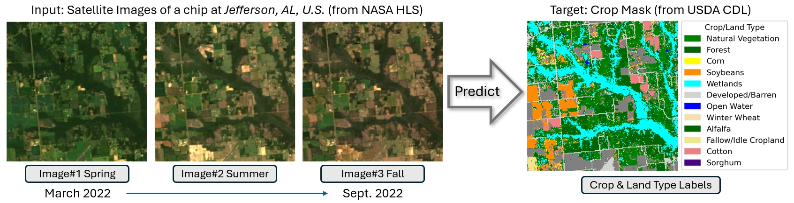

# `EarthBench` Image Task

**This directory holds the data, split, and preprocessing code for the EarthBench vision task.**

## Download

Raw data can be downloaded from the [Anonymous Google Drive](https://drive.google.com/drive/folders/1D-JntK90v48sKHmFum0nU58K6xsqlNHp?usp=sharing).

## Data Description

The EarthBench image dataset is a multi-temporal, multi-spectral dataset for crop segmentation and classification. 
The raw satellite images are derived from the NASA Harmonized Landsat Sentinel-2 (HLS) dataset, and the pixel-level target labels are derived from the USDA Crop Data Layer (CDL).



- **Input Image**: Each image chip at a single timestamp is a 224 x 224 pixel area at 30m spatial resolution with 6 spectral bands: Blue, Green, Red, Narrow NIR, SWIR 1, SWIR 2. For each chip, we retrieve 3 satellite images from the NASA HLS dataset evenly distributed in time from March to September 2022 to capture the ground view at different stages of the season. The final GeoTIFF file of a chip contains 18 bands including 6 spectral bands for three time steps stacked together.

- **Predict Target**: The target is a same-size GeoTIFF file with a single band recording the target class for each pixel. The target classes are derived from the USDA Crop Data Layer (CDL) and include 13 classes: 
    -   ```python
        0: "No Data",
        1: "Natural Vegetation",
        2: "Forest",
        3: "Corn",
        4: "Soybeans",
        5: "Wetlands",
        6: "Developed/Barren",
        7: "Open Water",
        8: "Winter Wheat",
        9: "Alfalfa",
        10: "Fallow/Idle Cropland",
        11: "Cotton",
        12: "Sorghum",
        13: "Other"
        ```

## Data Matching & Prerpocessing

- **Chip Initialization:** We first extract a set of 5,000 chips based on samples from the USDA CDL to ensure a representative sampling across the continental United States.
- **Spatial Alignment:** We then spatially align these chips with the 238 counties contained in the ERA5 data based on latitude and longitude. Specifically, for each chip-county pair, we check the average difference in latitude and longitude between the center point of the chip and the county. If the difference is less than 1, we assign the chip to the corresponding county. If multiple counties met the criteria, we assign the chip to the nearest county to ensure no overlap between chips within each county, thus preventing data leakage when performing county-based train/test split.
- **Temporal Alignment:** For each chip, we retrieve 3 satellite images from the NASA HLS dataset evenly distributed in time from March to September 2022 to capture the ground view at different stages of the season.
- **Image Quality Check:** We perform image quality check on each chip using the metadata, discarding any chip with clouds, cloud shadows, or missing values.
- **Final Dataset:** After all matching and filtering, we obtain **3138** valid chips corresponding to **169** counties.