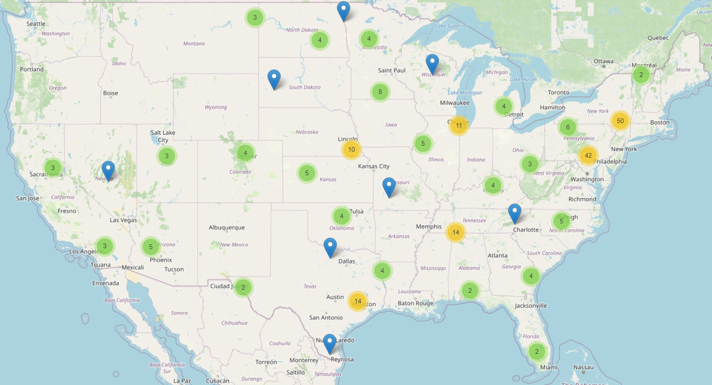
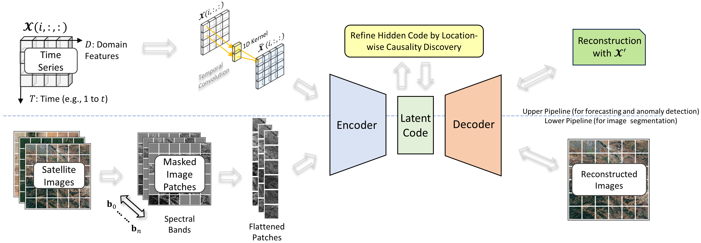

# EarthBench

To speed up the AGI development for climate science, we first propose a multi-modal climate benchmark named __EarthBench__, which aligns the [ERA5](https://cds.climate.copernicus.eu/cdsapp\#!/home) time series data for weather forecasting, [NOAA](https://www.ncdc.noaa.gov/stormevents/ftp.jsp) extreme weather events records (e.g., thunderstorm) for extreme weather alerts, and [HLS](https://huggingface.co/datasets/ibm-nasa-geospatial/multi-temporal-crop-classification) satellite image data for the crop segmentation, based on a unified spatial-temporal granularity.

Moreover, we also propose a simple generative model, called SGM, for each task in the proposed EarchBench. SGM is based on the encoder-decoder framework, and the choices of encoders and decoders vary for different tasks. Overall, in each task of EarchBench, SGM produces a competitive performance with different baseline methods.

## Dataset Statistics

Based on the domain expertise, we selected 45 thunderstorm-related weather features from ERA5 (e.g., wind gusts, rain, etc.) of 238 counties in the United States of America from 2017 to 2020. The details of these 45 weather features are specified in Appendix B of the paper. The geographic distribution of 238 selected counties in the United States of America is shown below, where the circle with numbers denotes the aggregation of spatially near counties. Among 238 selected counties, 100 are selected for the top-ranked counties based on the yearly frequency of thunderstorms. The rest are selected randomly to try to provide extra information (e.g., causal effect). Because we chose thunderstorms as the anomaly pattern to be detected after forecasting, we then mapped the name and code of locations in the NOAA dataset with the latitude and longitude of locations in the ERA5 dataset. After that, for each specific county, each row (i.e., hour) of 45 weather features in ERA5 will be associated with a thunderstorm label; if any minute in this hour has the thunderstorm record, then 1 will be marked; otherwise, 0 will be marked. The spatial-temporal distribution of thunderstorms in EarthBenth is shown below.

TABLE. Statistics of Thunderstorm Records in EarthBench over 238 Selected Counties in the United States from 2017 to 2021
| Year | 2017 | 2018 | 2019 | 2020 | 2021 |
|------|------|------|------|------|------|
| Jan  | 26   | 3    | 2    | 41   | 7    |
| Feb  | 53   | 6    | 9    | 50   | 8    |
| Mar  | 85   | 16   | 26   | 63   | 62   |
| Apr  | 93   | 44   | 140  | 170  | 60   |
| May  | 245  | 207  | 263  | 175  | 218  |
| Jun  | 770  | 302  | 348  | 331  | 452  |
| Jul  | 306  | 291  | 457  | 453  | 701  |
| Aug  | 294  | 269  | 415  | 354  | 435  |
| Sep  | 61   | 80   | 122  | 29   | 123  |
| Oct  | 32   | 32   | 82   | 60   | 55   |
| Nov  | 20   | 22   | 9    | 114  | 11   |
| Dec  | 5    | 15   | 11   | 8    | 58   |

FIGURE. Geographic Distribution of Covered Counties in EarthBench (The number in the circle stands for the aggregation of nearby counties)

FIGURE. A Specific Example of Jefferson, Alabama U.S. on 9:00-10:00, 01/05/2017, UTC Time

## A Simple Generative Model (SGM)
As shown in the below figure, the SGM is simply based on an encoder-decoder framework and has two pipelines. The upper pipeline is for time series forecasting (targeting the weather forecasting task) and anomaly detection (targeting the thunderstorm alerts). The lower pipeline is for image segmentation (targeting the temporal crop segmentation). Two pipelines have different choices of encoders and decoders. More details can be found in the paper.

FIGURE. The Proposed Simple Generative Model (SGM)

